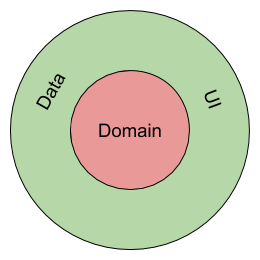
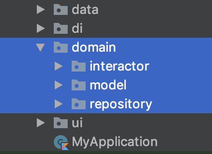
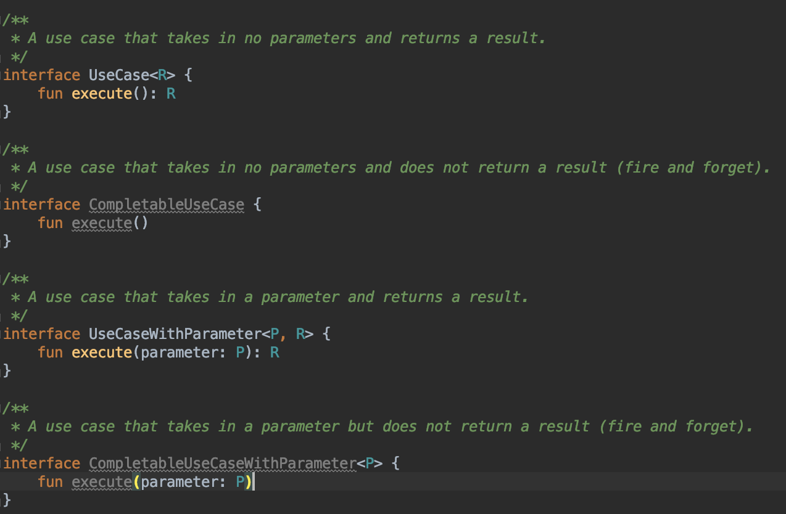
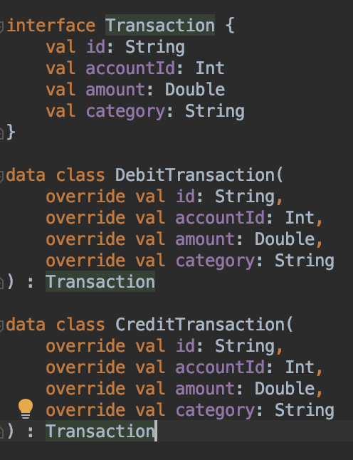
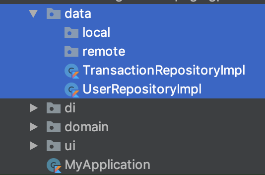
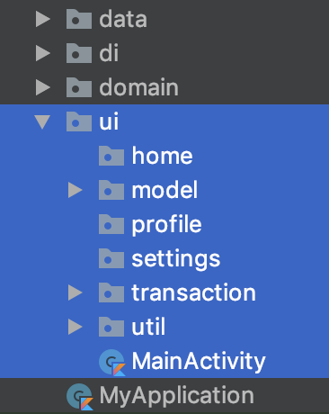
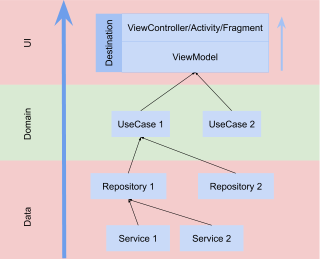

# A Cleaner Approach

This document describes a highly opinionated way of architecting an App based on Robert C. Martin's (Uncle Bob) [Clean Architecture](https://blog.cleancoder.com/uncle-bob/2012/08/13/the-clean-architecture.html). Fundamental to Uncle Bob's Clean Architecture are the *onion-like* layers and the *Dependency Rule*. An outer layer can depend on an inner layer but the reverse is **not allowed**. A simplified version of the original layers is used for our purpose.

*The discussion below uses an Android app, but it can easily be applied to an iOS app (or web app for that matter) as well.*

## Layers

### Domain

The domain layer contains the core business logic of the app. It shouldn't know anything about the outside world (UI, network, services, sensors etc.) but merely define the interfaces to interact with the outside world. This means that this can be a purely Kotlin or Swift (or whatever language that is being used) module. As a result, it's very easy to spot violations, because there is a clear understanding that things like HTTP connection code (Retrofit/Alamofire), database related code (sqlite), UI code (Android framework classes/UIViewController etc.) don't belong here.

The domain consists of the following:

#### 1. Interactors

Interactors are a collection of well defined use cases (essentially, what does this app do?). For a typical banking app you would have "Get Transactions", "Create Transaction", "Create Account", "Login" etc. And each of these use-cases should be carefully designed following [SOLID](./solid_principles.md) principles. Use cases **only** have a single public method `execute(...)`. No other methods or properties are exposed. To make things simpler, all use cases can conform to an interface pattern like the following.

#### 2. Models

These are your business models. An important distinction here is that these are not the same as API models or UI models (remember the domain module has no knowledge of APIs or UIs). All models **must** start as an interface. This helps to maintain the 'O' in SOLID principles. An added benefit is that we're favouring [composition over inheritance](https://en.wikipedia.org/wiki/Composition_over_inheritance) (although this particular example is a pretty bad one at showing the advantages of composition over inheritance).

#### 3. Repositories

This is a collection of interfaces to the outside world (e.g. `UserRepository`, `TransactionRepository`). These interfaces usually expose CRUD-like functionality but depending on the nature of the repository it may look different. The important thing is that only the interface is defined here and no implementation is available, because those belong in the data layer.

### Data

The data layer is where all the repository interfaces are implemented.

It's likely that these repository implementations depend on one or more services (E.g. remote service like a Retrofit interface, local cache like a Realm implementation). It's common practice to package those services as shown above. Response models, database models all belong here and should never be exposed outside of the data layer.

### Presentation (UI)

The presentation layer is a collection of *destinations* (screens or pages) and the routing implementation to move from destination to destination.

In the above example, `home`, `profile`, `settings`, `transaction` are all *destinations* in the app. A destination will use one or more *use cases* (from the domain layer) to build a feature or set of features that a user will interact with via the user interface. For e.g. the transactions destination utilizes the "Get Transactions" use case to display a list of transactions on the screen.

Destinations can use any UI pattern (MVP, MVVM) but the [Reactive MVVM](./reactive_mvvm.md) pattern is highly recommended. Routing between destinations is platform specific so it is not covered here.

#### Note about UI models

Sometimes the domain model can be directly used in the UI layer if it can be managed via extensions. These extensions and UI only models (if required) will sit in the `model` package in the UI layer. Note that a domain model can be used in the UI layer but a UI model **cannot** be used in the domain layer.

## Putting it all together with Dependency Injection

[Dependency Injection](https://en.wikipedia.org/wiki/Dependency_injection) plays a big role in putting this all together. The dependency graph looks like the following:

Note: Injection should always happen through constructor parameters unless there is a system limitation (e.g. ViewControllers, Activities, Fragments etc. where object instantiation happens by the system).

## Summary

The App has 3 modules

- Domain
- Data
- Presentation (UI)

The domain consists of the application use cases, business models and interfaces of the repositories. The data module contains the implementation of those repositories. The presentation module contains the UI (screens/pages) and routing implementations.